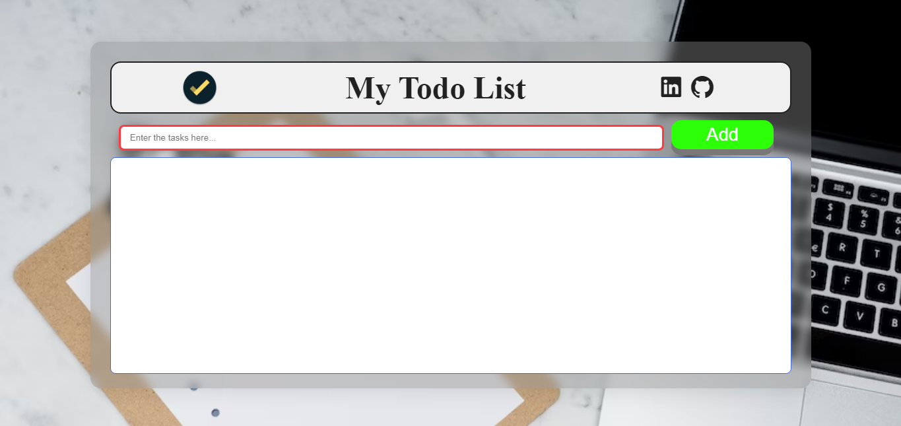
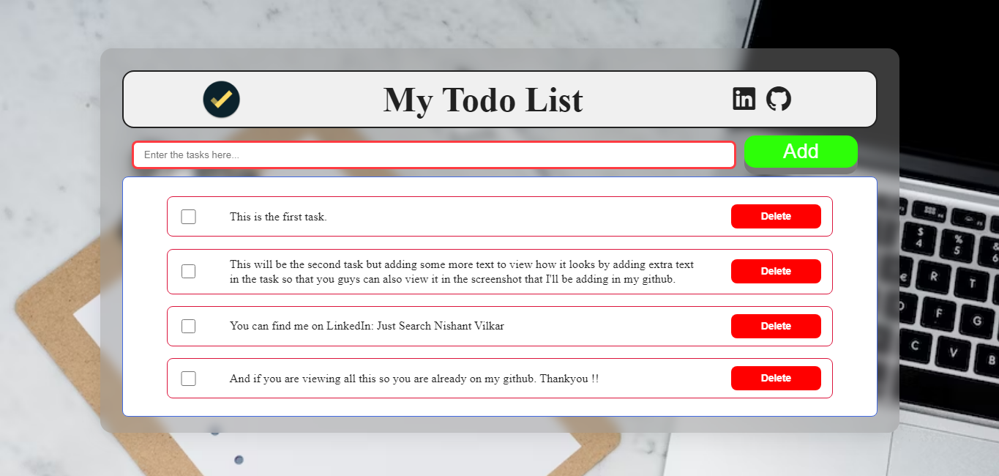

# TO-DO List Project
Created a simple to-do list to check my raw JavaScript skills.

## Built with
- HTML5
- CSS3
- Javascript

I have started learning frontend development and I think you learn more by doing the practical work.
This project is purely created by only using HTML, CSS, and Javascript.
I have added the screenshots of the project. You can check the project by cloning this repository.

## Desktop view

## Mobile view

Working on media queries so will add this asap...

## Made By
[NISHANT VILKAR](https://github.com/almightynv)
- [Linkedin](https://www.linkedin.com/in/nishantvilkar076/)
